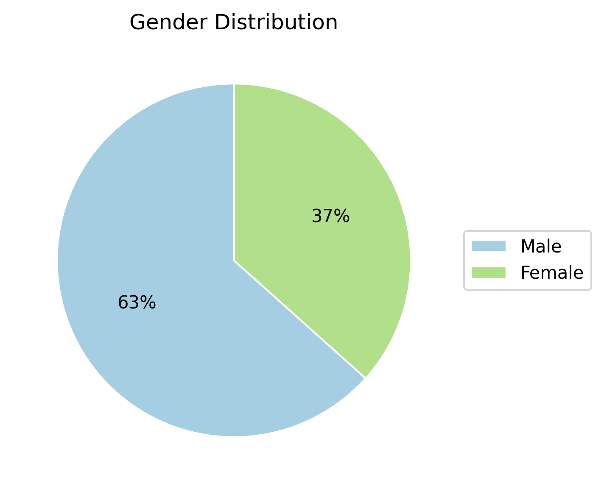
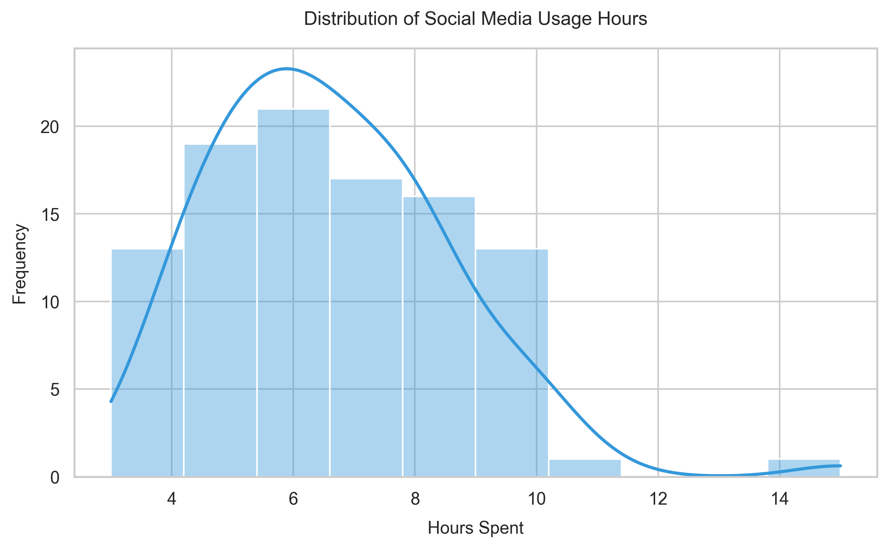
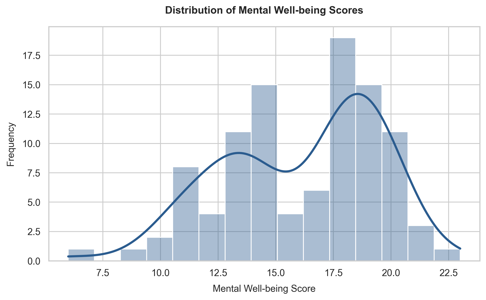
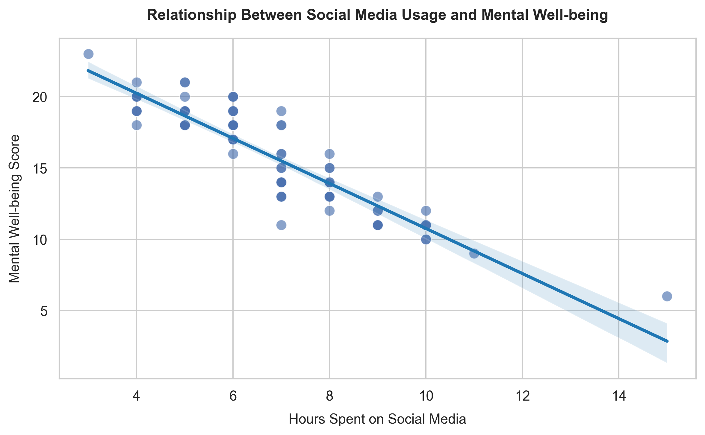
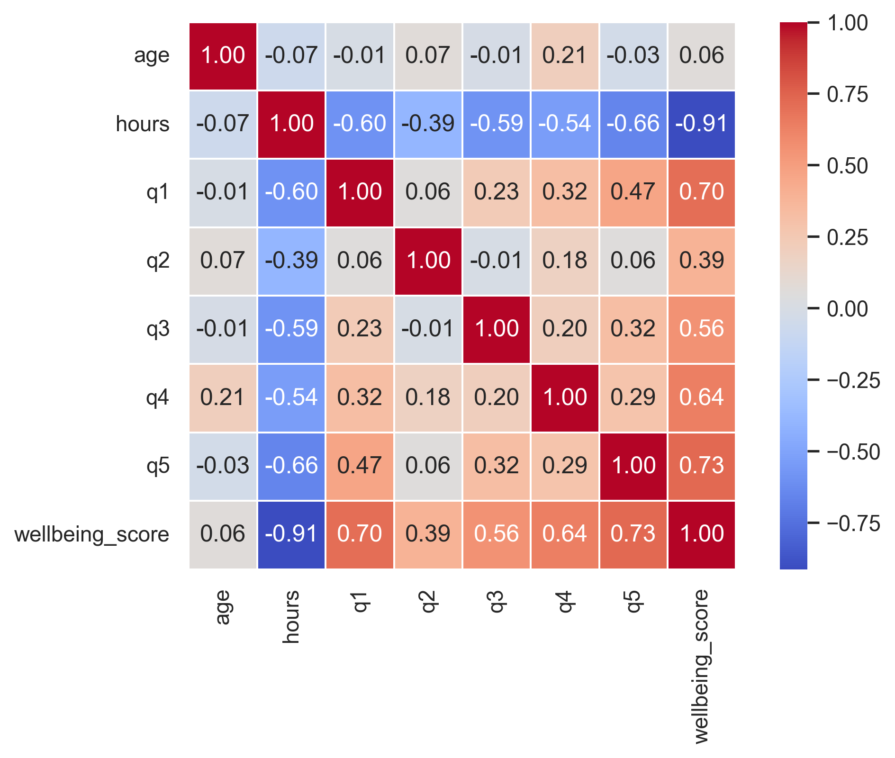
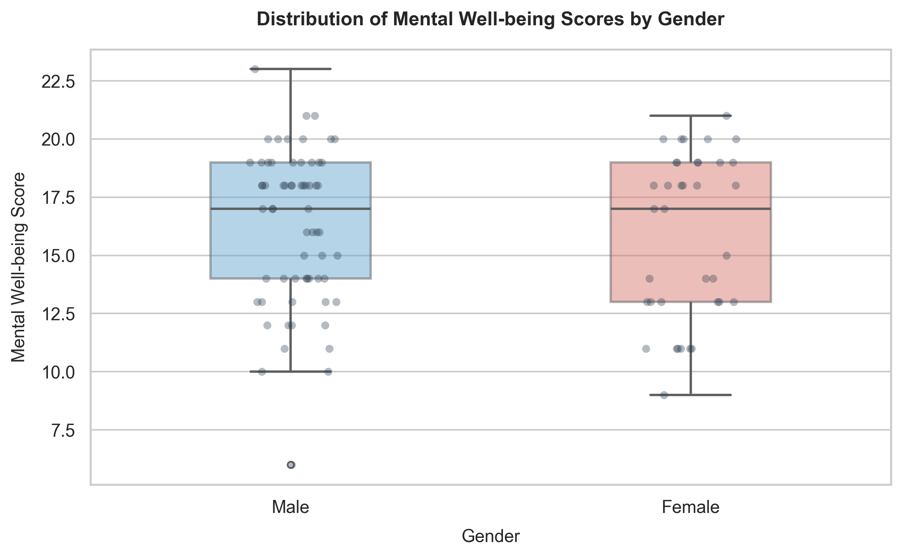
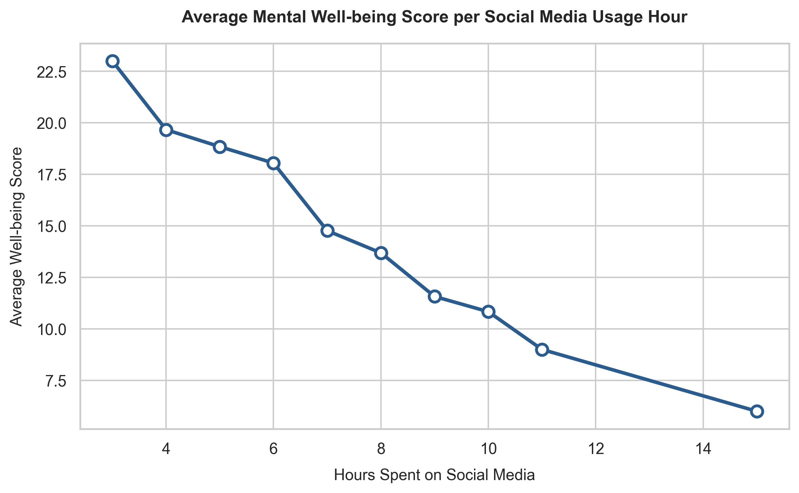
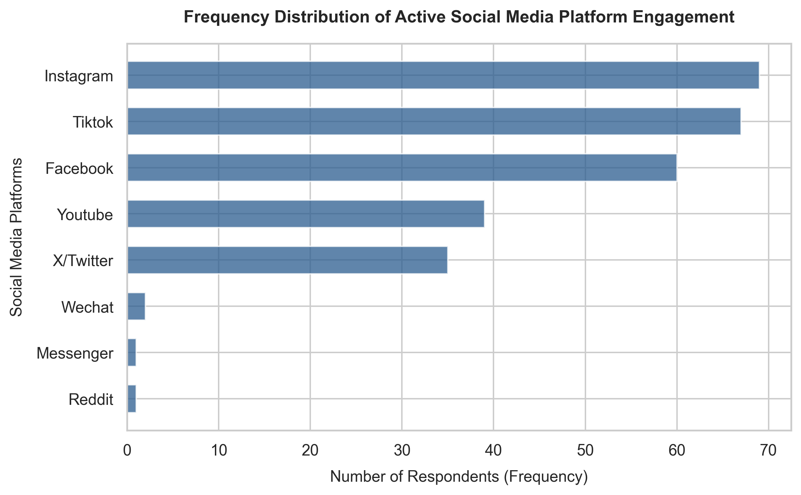
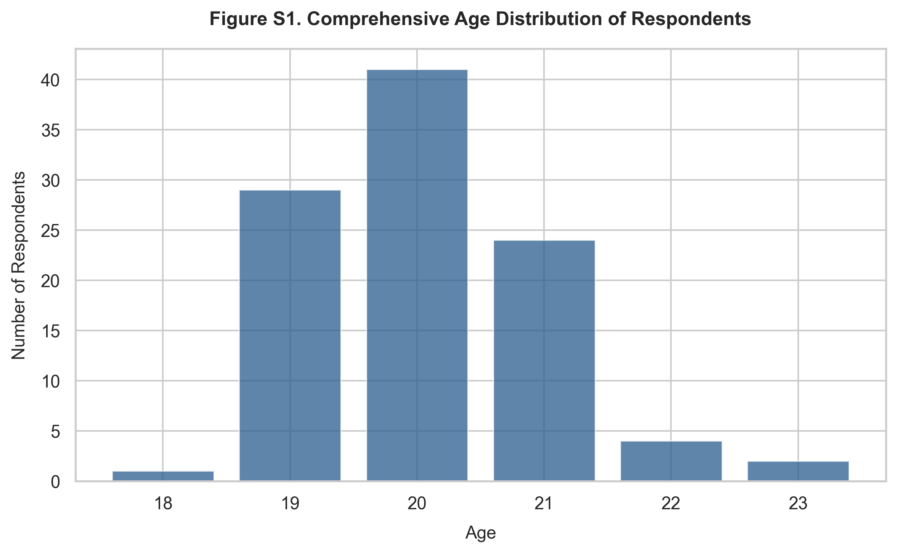

# 📊 Social Media Usage and Student Well-being Analysis

<p align="center">


</p>

---

## 📖 Overview

This project investigates the relationship between **daily social media usage** and **student well-being** using survey data and statistical analysis.

The complete workflow includes:

- Data loading
- Data cleaning
- Data preprocessing
- Encoding categorical responses
- Descriptive statistics
- Pearson correlation analysis
- Linear regression
- Data visualization

The objective is to determine whether increased social media usage is associated with changes in students' psychological well-being while demonstrating a complete end-to-end data analysis pipeline using Python.

---

# 🎯 Objectives

The project aims to:

- Clean and preprocess survey data
- Transform categorical responses into numerical values
- Calculate an overall Well-being Score
- Analyze relationships between variables
- Measure the strength of correlation
- Perform linear regression analysis
- Generate publication-quality visualizations
- Produce processed datasets for further research

---

# 📂 Project Structure

```text
Correlation-research/
│
├── data/
│   ├── raw/
│   │     survey_data.csv
│   │
│   └── processed/
│         Encoded Dataset.csv
│
├── reports/
│   ├── figures/
│   └── tables/
│
├── src/
│   ├── main.py
│   ├── data_cleaning.py
│   ├── analysis.py
│   └── visualization.py
│
├── requirements.txt
├── .gitignore
└── README.md
```

---

# 🔄 Project Workflow

```text
                 Survey Dataset
                       │
                       ▼
               Load CSV Dataset
                       │
                       ▼
                 Data Cleaning
      • Remove missing values
      • Remove duplicates
      • Rename columns
                       │
                       ▼
               Data Encoding
      • Convert Likert Scale
      • Compute Well-being Score
                       │
                       ▼
          Statistical Analysis
      • Descriptive Statistics
      • Correlation Analysis
      • Linear Regression
                       │
                       ▼
              Data Visualization
                       │
                       ▼
             Research Findings
```

---

# 🧹 Data Cleaning

The dataset is processed through several preprocessing steps:

- Removal of missing values
- Removal of duplicate records
- Standardization of column names
- Whitespace trimming
- Validation of survey responses

---

# 🔢 Data Encoding

Survey responses use a five-point Likert Scale.

| Response | Numerical Value |
|-----------|----------------:|
| Strongly Disagree | 1 |
| Disagree | 2 |
| Neutral | 3 |
| Agree | 4 |
| Strongly Agree | 5 |

The encoded responses are used to compute an overall **Well-being Score**.

---

# 📈 Statistical Analysis

The project performs:

### Descriptive Statistics

- Frequency Distribution
- Percentages
- Summary Statistics

### Correlation Analysis

Pearson Correlation Coefficient

Measures the relationship between:

- Daily Social Media Usage
- Well-being Score

### Linear Regression

Calculates:

- Slope
- Intercept
- Correlation Coefficient (R)
- P-value
- Standard Error

---

# 📊 Visualizations

The project automatically generates the following visualizations:

- Gender Distribution
- Age Distribution
- Social Media Usage Distribution
- Well-being Score Distribution
- Correlation Boxplot
- Correlation Matrix
- Average Well-being Score
- Frequency Distribution
- Well-being by Gender

---

# 🖼️ Sample Outputs

## Gender Distribution



---

## Social Media Usage Distribution



---

## Well-being Score Distribution



---

## Correlation ScatterPlot



---

## Correlation Matrix



---

## Well-being by Gender



---

## Average Well-being Score



---

## Frequency Distribution



---

## Age Distribution



---

# 📋 Generated Outputs

After execution, the project automatically generates:

- Cleaned Dataset
- Encoded Dataset
- Statistical Tables
- Correlation Analysis
- Regression Results
- Publication-quality Figures

---

# 💻 Technologies Used

| Technology | Purpose |
|------------|---------|
| Python | Programming Language |
| Pandas | Data Cleaning |
| NumPy | Numerical Computing |
| SciPy | Statistical Analysis |
| Matplotlib | Visualization |
| Seaborn | Statistical Graphics |

---

# ⚙️ Installation

Clone the repository

```bash
git clone https://github.com/YOUR_USERNAME/Correlation-research.git
```

Move into the project directory

```bash
cd Correlation-research
```

Install dependencies

```bash
pip install -r requirements.txt
```

Run the project

```bash
python src/main.py
```

---

# 📊 Example Output

The program prints statistical summaries similar to:

```
Correlation coefficient (r): -0.914

Slope: -1.58

Intercept: 26.56

P-value: 1.42e-40
```

It also generates multiple visualizations inside:

```text
reports/figures/
```

---

# 🚀 Future Improvements

Possible enhancements include:

- Interactive Dashboard (Streamlit)
- Multiple Regression Analysis
- Predictive Machine Learning Models
- Additional Statistical Tests
- Larger Survey Dataset
- Automated PDF Report Generation

---

# 👨‍💻 Author

**Christian Devera**

Bachelor of Science in Computer Science

Interested in:

- Artificial Intelligence
- Data Analytics
- Machine Learning
- Data Visualization
- Python Development

---

# ⭐ Support

If you found this project useful, consider giving it a **⭐ Star** on GitHub.

Feedback and suggestions are always welcome.